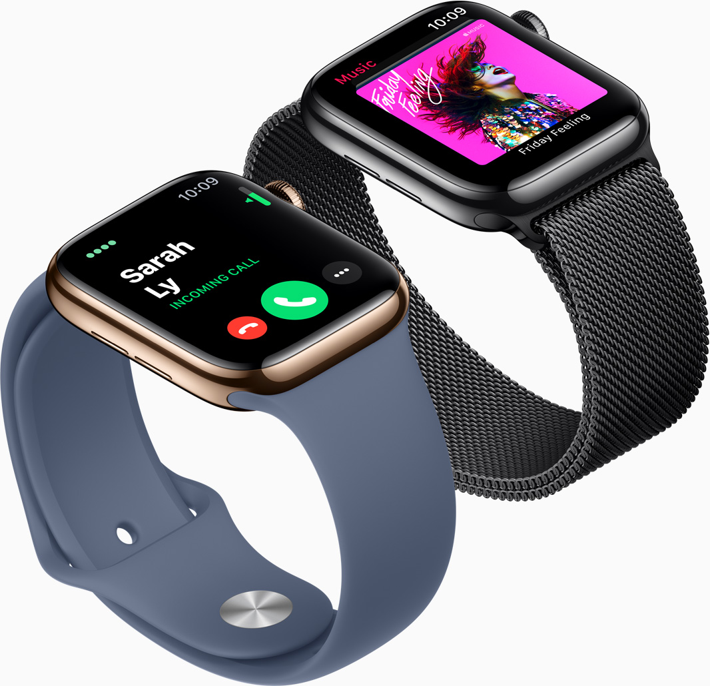

Inspire by Apple.com

# Apple Website Scss Recreation
Sass &amp; Scss Design - Apple Watch Series 5 Web Recreation

features added:

// Add page payment interface
// Confirmation item interface

Please click the check out button in the top right corner of the shopping cart.

Please click the buy button to enter the merchandise shopping area.

Some interface they use canvas with their own scss object so some can't be completely restored. Sorry.

Original apple watch series 5 official website
Https://www.apple.com/apple-watch-series-5/

Design concept: because I appreciate the design concept of apple, I want to test my own limit by this exercise.

Because I don't believe that there is a website that can't be done. I see that many people think it is impossible to make it on the Apple website.

Feel yourself pushing yourself to the limit

Not complete section:

Because the apple website will use different photos and objects.

So my mobile version is not all set up, because there are so many objects and pictures are different from the desktop version
, need to collect all the pictures one by one so the process will be slow, but I will compelete anyway!!:))
and also because of the interview, there is no way to completely complete the mobile version in short time =v=
I am very sorry, but the computer version has been completed and will be completed in the future.

Summary of experience:

When I made this Apple official website recreation , I felt very challenging inside. I felt very excited. I have encountered many problems and obstacles.

But I can't help but admire the care and patience of Apple engineers. There is only a small animation, but they still wrote a bunch of codes to achieve

, this professionalism has been completely different from the average person. Very simple and powerful design.

Animation and layout are very special, The user will be very comfortable to watch their product. Apple is the one that we all need to respect for.
